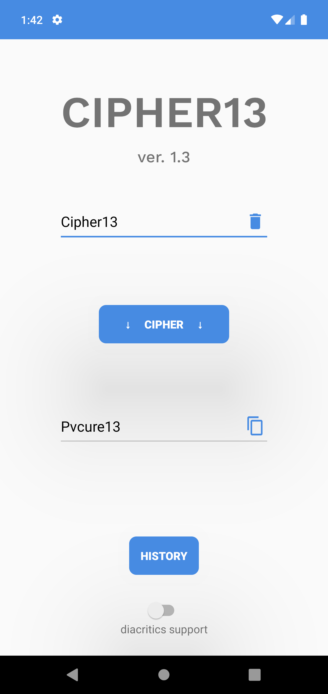
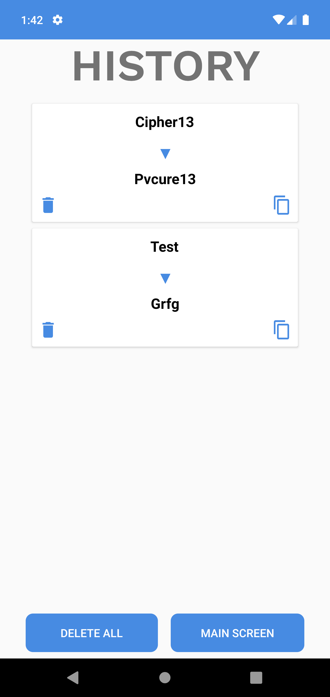

# Cipher13
A simple app to cipher some text using ROT13.

## Features
1. Main screen
    - Supports Arabic, with and without diacritics
    - A paste button in input field if it's empty (no need for the Keyboard!)
    - A delete button in input field if it isn't empty
    - A copy button in output field
    - A switch button to turn on and off diacritics support (off by default)
2. History screen
    - All ciphered text is saved
    - Copy old ciphered text
    - Delete old ciphered text
    - Delete all history

## Screens

